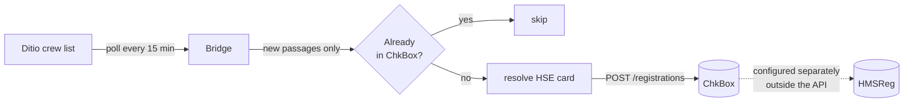

# 12 — Crew list → Infotech ChkBox (HSE register)

Push Ditio's crew list (*mannskapsliste*) into Infotech's **ChkBox / byggekortleser** API, so
check-in and check-out passages land in the project owner's HSE register without anyone
registering twice.

> **This is a starting point, not a product.** Ditio does not run this bridge for you. Copy it,
> deploy it somewhere that stays running, and extend it to fit your setup.

## Why this exists

On sites where the *byggherre* uses Infotech for crew registration and the contractor uses Ditio,
workers otherwise register twice. Infotech's registrations flow **out** to HMSReg, never the other
way — so the way to remove the double registration is to push Ditio's passages **into** ChkBox
directly. That is what this sample does.

## How it works



Each poll:

1. Reads crew data changed since the last cycle.
2. Turns each stay into passages — an `in` at check-in, and an `out` once the person leaves.
3. Drops anything already posted (local state) or already present in ChkBox (read-back).
4. Resolves the worker's HSE card number to a ChkBox card id.
5. Posts the passages.

## Concepts

| Term | Meaning |
|---|---|
| **Passage** | One `in` or `out` event. ChkBox calls these *registrations*. |
| **HSE card / byggekort** | The card number that identifies a worker to both systems. This is the join key — without it a worker cannot be bridged. |
| **ChkBox project id** | An opaque id such as `SKK180039`. Ask the project owner; it is not derivable from Ditio. |
| **Card resource id** | ChkBox's internal id for a card, resolved via `GET /cards?filter[cardId]=`. Never construct it yourself. |

## Before you start

Three things, and two of them come from someone else — start those first, they take the longest.

| What you need | Where it comes from |
|---|---|
| **Ditio API credentials** — `client_id` + `client_secret` | Ditio Web → Company Setup (Oppsett) → Integration → Create new API client. Requires Administrator access; the secret is shown **once**. Scope `reportingapiv1` (add `ditioapiv3` if you use the legacy source). See [`../authentication`](../authentication). |
| **ChkBox API key** | Infotech (`support@infotech.no`). The key belongs to the **project owner (byggherre)**, so request it through them. Test (`devapi.byggekortleser.no`) and production (`api.byggekortleser.no`) use *separate* keys. |
| **ChkBox project id** per site | The project owner. Looks like `SKK180039`. It cannot be derived from Ditio — you have to be told it. |

Use credentials with **supervisor or administrator** access. Field-worker-level credentials only see
their own entries, so the bridge will appear to run fine and post nothing.

Each worker's HSE card must also already be **known to ChkBox** — registered on a project or
pre-approved into an access group somewhere in the project owner's account. ChkBox will not create
people or cards, so a worker it has never seen cannot receive passages until the project owner adds
them.

## Configure

Add a `ChkBox` section to `appsettings.json` (git-ignored — **never commit the API key**):

```json
{
  "ChkBox": {
    "BaseUrl": "https://devapi.byggekortleser.no",
    "ApiKey": "your-key-from-infotech",
    "DryRun": true,
    "PollIntervalMinutes": 15,
    "Source": "online-users",
    "TimeZone": "Europe/Oslo",
    "StateFilePath": "chkbox-bridge-state.json",
    "BackfillHours": 0,
    "Projects": [
      { "DitioProjectId": "5f2b8c1de4b0a12f34d56a78", "DitioProjectNumber": "1042", "ChkBoxProjectId": "SKK180039" }
    ]
  }
}
```

Environment variables work too: `DITIO_ChkBox__ApiKey`, `DITIO_ChkBox__DryRun`, and so on.

| Setting | Default | Notes |
|---|---|---|
| `DryRun` | `true` | Prints the passages it would post and writes nothing — not to ChkBox, and not to the state file either, so the cursor stays put and the first live run still posts everything you previewed. **Run this way first.** |
| `PollIntervalMinutes` | `15` | Ditio's crew data does not change fast enough to warrant less. |
| `RunOnce` | `false` | Run one cycle and exit — use under cron or a Kubernetes CronJob. |
| `Source` | `online-users` | See [Choosing a source](#choosing-a-source). |
| `TimeZone` | `Europe/Oslo` | Only used by the `online-users` source, which returns times with no offset. |
| `StateFilePath` | `chkbox-bridge-state.json` | **Must be durable.** Holds the cursor and the posted-passage set. |
| `BackfillHours` | `0` | `0` means today only. Raise once for a backfill, then set it back. |
| `PostedPassageRetentionDays` | `30` | How long a posted passage is remembered. |

## Run it

```bash
dotnet run -- 11
```

Startup verifies every ChkBox project id resolves before doing any work:

```
Source     : online-users (api/v3/onlineusers/activeonly)
ChkBox     : https://devapi.byggekortleser.no
Mode       : DRY RUN — nothing will be written to ChkBox
✓ Ditio 1042 → ChkBox SKK180039 (Grønvollfoss kontrollanlegg)

[09:15:02] Polling…
  Read 14 registration(s); 3 new passage(s) to consider.
  [dry run] in  2026-08-17T06:58:12+02:00 card 43****61 → SKK180039
  Would post 3; 0 already in ChkBox; 0 unknown card(s); 0 error(s).
```

Once the output looks right, set `DryRun` to `false`.

## Choosing a source

| `Source` | Endpoint | Use when |
|---|---|---|
| `crew-list-registrations` **(default)** | `GET v1/crew-list-registrations` on the reporting host, scope `reportingapiv1` | Always, unless you have a reason not to. |
| `online-users` | `GET api/v3/onlineusers/activeonly`, scope `ditioapiv3` | Legacy. Kept for anyone already on it. |

`crew-list-registrations` is passage-level, returns UTC, and supports proper incremental sync with
`ModifiedSince` + `ContinuationToken` and `isDeleted` tombstones.

`online-users` is the older backoffice crew list, and has real limits:

- **No delta support** — no cursor, no pagination, no changed-since filter. Every poll re-reads the
  whole day window and the bridge diffs client-side.
- **Aggregated per person per day** — `startTime` is the first check-in of the day and `stopTime`
  the last check-out. If someone leaves and comes back, the middle passages are invisible here and
  will not reach ChkBox.
- **Times carry no UTC offset** — they are in the calling user's configured time zone, hence the
  `TimeZone` setting. Get this wrong and every passage is shifted.

Switching between them is a one-line config change.

Both sources default to **today** when there is no stored cursor, matching the crew list's own
behaviour. Use `BackfillHours` to reach further back.

## How duplicates are prevented

ChkBox has **no idempotency key** on `POST /registrations`, so this is the bridge's job. There are
two independent guards:

1. **Local state** — every posted passage is recorded in the state file and never posted again.
2. **Read-back** — before writing, the bridge reads existing registrations for the project and
   skips passages already there (matched on card + action + time within a minute).

The second guard is what protects you if the state file is lost. It is verified behaviour: with the
state file deleted and the same crew data replayed, the bridge posts nothing.

The cursor only advances when a cycle completes without errors, so a Ditio outage or a failed post
means the next cycle retries rather than skipping. A dry run does not advance it either — otherwise
switching `DryRun` off would silently skip every passage you had just previewed.

## Deploy it

Two shapes — pick whichever fits your estate:

- **Long-running process** — leave `RunOnce: false`. It polls on its own timer. Keep it alive with
  systemd, a Windows Service, or a container restart policy.
- **Scheduled** — set `"RunOnce": true` and invoke it every 15 minutes from cron, Task Scheduler, or
  a Kubernetes CronJob. It runs one cycle and exits.

Two things that matter in production:

- **The state file must be on durable storage.** It holds the sync cursor and the record of what has
  already been posted. In a container, mount a volume — an ephemeral disk means it starts fresh on
  every restart.
- **Run exactly one instance per project.** Two instances polling the same project will race and can
  post duplicates.

## What to lift into your own code

If you are rebuilding rather than running this as-is:

| File | What it is |
|---|---|
| [`ChkBoxBridge.cs`](ChkBoxBridge.cs) | One poll cycle — read, diff, dedupe, post. **This is the part worth lifting.** |
| [`ChkBoxClient.cs`](ChkBoxClient.cs) | The ChkBox API client — card and project lookup, posting registrations |
| [`CrewModels.cs`](CrewModels.cs) + the sources | Where crew data comes from, behind one interface |
| [`BridgeState.cs`](BridgeState.cs) | Sync cursor and the record of what has been posted |
| [`CrewListChkBoxExample.cs`](CrewListChkBoxExample.cs) | Console wiring and the poll loop — the least reusable part |

`ChkBoxBridge` has no console dependency, so it drops into a `BackgroundService`, an Azure Function,
or whatever host you already run.

## Caveats — please read

Most of these are silent. Nothing errors; workers simply do not appear in ChkBox.

**A worker with no HSE card number in Ditio is skipped entirely.** The HSE card (byggekort) number
is the *only* thing linking a person in Ditio to a person in ChkBox. If it is not filled in on their
profile in Ditio, there is nothing to match on and the passage is dropped. The bridge reports a
count every cycle (`N skipped — no HSE card number registered in Ditio`) but will not fail. **Watch
that number** — if it is not zero, someone on site is not reaching your HSE register.
*Fix: register the byggekort number on the worker's profile in Ditio.*

**A worker ChkBox has never seen cannot be matched either.** ChkBox will not create people or cards.
It can only find a card already used on a site or pre-approved into an access group somewhere in the
project owner's account. The bridge logs `Card 43****61 is unknown to ChkBox` and carries on.
*Fix: the project owner adds the card in ChkBox, usually by pre-approving it onto the project.*

**The legacy source reports one record per person per day.** `online-users` gives the first check-in
and last check-out only, so a worker who leaves at lunch and returns produces one long stay instead
of two passages. `crew-list-registrations` does not have this limitation — prefer it.

**Timestamps from the legacy source depend on `TimeZone`.** `online-users` returns times with no UTC
offset, so a wrong `TimeZone` shifts every passage — silently, and consistently enough to look
plausible. `crew-list-registrations` returns UTC and ignores the setting.

**ChkBox has no delete for registrations.** A passage retracted in Ditio cannot be withdrawn; the
tombstone only stops further posts. Plan corrections manually with the project owner.

**`POST /registrations` returns `202 Accepted` with an empty body** — processed asynchronously, so a
passage may not read back immediately. The local state guard covers that window.

**`hmsRegNumber` is often `null`** on ChkBox projects, so project mapping is explicit config rather
than automatic.

**The crew list is personal data** — names, birth dates, phone numbers, HSE card ids. This sample
logs counts and redacted card numbers only, and sends ChkBox nothing beyond card, project, action
and time. Keep it that way, and process the data in line with your data-processing agreement and
GDPR obligations.

## What to monitor

Every cycle prints one summary line:

```
Posted 3; 0 already in ChkBox; 0 unknown card(s); 0 error(s).
```

| Signal | What it means |
|---|---|
| `error(s)` above zero, repeatedly | Connectivity or credentials. The cursor is held back so nothing is lost — it retries — but it will not clear on its own if the cause persists. |
| `unknown card(s)` above zero | Someone on site is not registered in ChkBox. Needs a person, not a retry. |
| `skipped — no HSE card` above zero | Someone on site has no byggekort number in Ditio. Also needs a person. |
| No output at all | The process died. Nothing is lost — it resumes from its cursor — but presence stops flowing until it restarts. |

## Reference & support

- Crew list API — [Crew List (Mannskapsliste)](https://docs.ditio.app/guides/crew-list/)
- ChkBox API specification — <https://api.byggekortleser.no/spec/> (JSON:API v1.0)

| Topic | Contact |
|---|---|
| Ditio API, credentials, the crew list | `support@ditio.no` |
| ChkBox API keys, project ids, adding cards | `support@infotech.no` |
| This sample | Open an issue on this repository |
