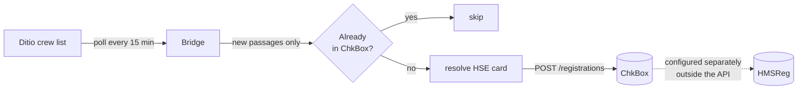

# 12 — Crew list → Infotech ChkBox (HSE register)

Push Ditio's crew list (*mannskapsliste*) into Infotech's **ChkBox / byggekortleser** API, so
check-in and check-out passages land in the project owner's HSE register without anyone
registering twice.

> **This is a starting point, not a product.** Ditio does not run this bridge for you. Copy it,
> deploy it somewhere that stays running, and extend it to fit your setup.

## Why this exists

On sites where the *byggherre* uses Infotech for crew registration and the contractor uses Ditio,
workers otherwise register twice. Infotech's registrations flow **out** to HMSReg, never the other
way — so the way to remove the double registration is to push Ditio's passages **into** ChkBox
directly. That is what this sample does.

## How it works



Each poll:

1. Reads crew data changed since the last cycle.
2. Turns each stay into passages — an `in` at check-in, and an `out` once the person leaves.
3. Drops anything already posted (local state) or already present in ChkBox (read-back).
4. Resolves the worker's HSE card number to a ChkBox card id.
5. Posts the passages.

## Concepts

| Term | Meaning |
|---|---|
| **Passage** | One `in` or `out` event. ChkBox calls these *registrations*. |
| **HSE card / byggekort** | The card number that identifies a worker to both systems. This is the join key — without it a worker cannot be bridged. |
| **ChkBox project id** | An opaque id such as `SKK180039`. Ask the project owner; it is not derivable from Ditio. |
| **Card resource id** | ChkBox's internal id for a card, resolved via `GET /cards?filter[cardId]=`. Never construct it yourself. |

## Prerequisites

- Ditio API credentials with the `ditioapiv3` scope (and `reportingapiv1` if you use the
  data-extraction source) — see [`../authentication`](../authentication).
- A **ChkBox API key** from Infotech (`support@infotech.no`). Test and production use *separate*
  keys. Development/testing is `https://devapi.byggekortleser.no`; production is
  `https://api.byggekortleser.no`.
- The **ChkBox project id** for each site you want to bridge, from the project owner.
- Each worker's HSE card must already be **known to ChkBox** — registered on a project or
  pre-approved into an access group somewhere in the tenant. ChkBox will not create people or
  cards, so a worker it has never seen cannot receive passages until the project owner adds them.

## Configure

Add a `ChkBox` section to `appsettings.json` (git-ignored — **never commit the API key**):

```json
{
  "ChkBox": {
    "BaseUrl": "https://devapi.byggekortleser.no",
    "ApiKey": "your-key-from-infotech",
    "DryRun": true,
    "PollIntervalMinutes": 15,
    "Source": "online-users",
    "TimeZone": "Europe/Oslo",
    "StateFilePath": "chkbox-bridge-state.json",
    "BackfillHours": 0,
    "Projects": [
      { "DitioProjectId": "5f2b8c1de4b0a12f34d56a78", "DitioProjectNumber": "1042", "ChkBoxProjectId": "SKK180039" }
    ]
  }
}
```

Environment variables work too: `DITIO_ChkBox__ApiKey`, `DITIO_ChkBox__DryRun`, and so on.

| Setting | Default | Notes |
|---|---|---|
| `DryRun` | `true` | Prints the passages it would post and writes nothing — not to ChkBox, and not to the state file either, so the cursor stays put and the first live run still posts everything you previewed. **Run this way first.** |
| `PollIntervalMinutes` | `15` | Ditio's crew data does not change fast enough to warrant less. |
| `RunOnce` | `false` | Run one cycle and exit — use under cron or a Kubernetes CronJob. |
| `Source` | `online-users` | See [Choosing a source](#choosing-a-source). |
| `TimeZone` | `Europe/Oslo` | Only used by the `online-users` source, which returns times with no offset. |
| `StateFilePath` | `chkbox-bridge-state.json` | **Must be durable.** Holds the cursor and the posted-passage set. |
| `BackfillHours` | `0` | `0` means today only. Raise once for a backfill, then set it back. |
| `PostedPassageRetentionDays` | `30` | How long a posted passage is remembered. |

## Run it

```bash
dotnet run -- 11
```

Startup verifies every ChkBox project id resolves before doing any work:

```
Source     : online-users (api/v3/onlineusers/activeonly)
ChkBox     : https://devapi.byggekortleser.no
Mode       : DRY RUN — nothing will be written to ChkBox
✓ Ditio 1042 → ChkBox SKK180039 (Grønvollfoss kontrollanlegg)

[09:15:02] Polling…
  Read 14 registration(s); 3 new passage(s) to consider.
  [dry run] in  2026-08-17T06:58:12+02:00 card 43****61 → SKK180039
  Would post 3; 0 already in ChkBox; 0 unknown card(s); 0 error(s).
```

Once the output looks right, set `DryRun` to `false`.

## Choosing a source

| `Source` | Endpoint | Use when |
|---|---|---|
| `online-users` | `GET api/v3/onlineusers/activeonly` (scope `ditioapiv3`) | Works today. Snapshot only. |
| `crew-list-registrations` | `GET v1/crew-list-registrations` on the reporting host (scope `reportingapiv1`) | Preferred once available on your environment. |

`online-users` is the backoffice crew list. It has real limits you should understand:

- **No delta support** — no cursor, no pagination, no changed-since filter. Every poll re-reads the
  whole day window and the bridge diffs client-side.
- **Aggregated per person per day** — `startTime` is the first check-in of the day and `stopTime`
  the last check-out. If someone leaves and comes back, the middle passages are invisible here and
  will not reach ChkBox.
- **Times carry no UTC offset** — they are in the calling user's configured time zone, hence the
  `TimeZone` setting. Get this wrong and every passage is shifted.

`crew-list-registrations` is passage-level (nothing is lost), returns UTC, and supports proper
incremental sync with `ModifiedSince` + `ContinuationToken` and `isDeleted` tombstones. Switching
is a one-line config change.

Both sources default to **today** when there is no stored cursor, matching the crew list's own
behaviour. Use `BackfillHours` to reach further back.

## How duplicates are prevented

ChkBox has **no idempotency key** on `POST /registrations`, so this is the bridge's job. There are
two independent guards:

1. **Local state** — every posted passage is recorded in the state file and never posted again.
2. **Read-back** — before writing, the bridge reads existing registrations for the project and
   skips passages already there (matched on card + action + time within a minute).

The second guard is what protects you if the state file is lost. It is verified behaviour: with the
state file deleted and the same crew data replayed, the bridge posts nothing.

The cursor only advances when a cycle completes without errors, so a Ditio outage or a failed post
means the next cycle retries rather than skipping. A dry run does not advance it either — otherwise
switching `DryRun` off would silently skip every passage you had just previewed.

## Limitations & notes

- **`POST /registrations` returns `202 Accepted` with an empty body** — it is processed
  asynchronously, so a passage may not be readable for a moment after posting. The local state
  guard covers that window.
- **ChkBox has no delete for registrations.** A passage retracted in Ditio cannot be withdrawn from
  ChkBox by this bridge; the tombstone only stops further posts.
- **Workers with no HSE card number in Ditio are skipped** and reported as a count each cycle.
- **`hmsRegNumber` is often `null`** on ChkBox projects, so project mapping is explicit config
  rather than automatic.
- **The crew list is personal data** (names, birth dates, phone numbers, HSE card ids). This sample
  logs counts and redacted card numbers only, and sends ChkBox nothing beyond the card, project,
  action and time. Keep it that way, and process the data in line with your data-processing
  agreement and GDPR obligations.
- **Run one instance.** Two bridges sharing a project will race and can double-post.

## Reference

- ChkBox API specification — <https://api.byggekortleser.no/spec/> (JSON:API v1.0)
- Infotech support — `support@infotech.no`

**C#:** [`CrewListChkBoxExample.cs`](CrewListChkBoxExample.cs) (wiring + poll loop) ·
[`ChkBoxBridge.cs`](ChkBoxBridge.cs) (one cycle — the part to lift) ·
[`ChkBoxClient.cs`](ChkBoxClient.cs) (ChkBox API).
