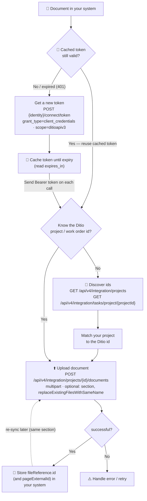

# 04 — Documents

Push documents (PDF, Word, images, …) to Ditio **projects** and **work orders**, and look up the ids you need to do so. Documents you push are surfaced in the Ditio **Info Center**, so field workers assigned to the project see them in the **mobile app** — grouped into a folder per project, and (optionally) into named **sections** within it.

`api/v4/integration/projects/{id}/documents` · scope `ditioapiv3`. Set `$BASE_URL` / `$TOKEN` first — see [`../authentication`](../authentication). Runnable C# example: [`DocumentsExample.cs`](DocumentsExample.cs).

## Concepts (read this first)

| Term | What it is |
|------|------------|
| **Project** | A top-level job in Ditio. Has a Ditio **id** (a string like `65f1a2b3c4d5e6f7a8b9c0d1`) and a human **project number** (e.g. `P-2025-001`). |
| **Work order** (called a *task* in the API) | A unit of work inside a project. Also has a Ditio **id**. |
| **Document** | Any file (PDF, Word, image, …) you push to a project or work order. It becomes a document on an Info Center page, visible to that project's members on mobile. |
| **Section** | Optional name that groups a project's documents into a page (e.g. `Drawings`, `Contracts`). Re-using the same `(project, section)` adds to the same page. Omit it and documents land on a default **"Documents"** page. |
| **`fileReference.id`** | The id Ditio gives back when you push a document. Save it — you need it to download or delete that document later. |
| **`pageExternalId`** | Returned on upload; the stable handle of the Info Center page the documents landed on. |

You push a document using the **Ditio id** of a project or work order. You don't know those ids yet — **steps 2 and 3 below show how to find them.**

> **Auth:** every request needs a Bearer token with the `ditioapiv3` scope (step 1). Your API client must have **Administrator** access, and can only see/act on projects in your own company.

## Environments

| | Production | Test |
|---|---|---|
| **API base** | `https://integration.ditio.no` | `https://core-api.ditio.dev/core` |
| **Identity (token endpoint)** | `https://identity.ditio.app/connect/token` | `https://identity.ditio.dev/connect/token` |
| **Scope** | `ditioapiv3` | `ditioapiv3` |
| **Swagger** | `https://integration.ditio.no/swagger` | `https://core-api.ditio.dev/core/swagger` |

The curl examples below work for **either environment** — set `IDENTITY` and `BASE_URL` once (see step 1) to the Production or Test values from the table above. In Postman, import the matching environment file (*Production* or *Test*) and select it. Credentials are issued separately per environment, and test data is periodically re-synced from production (anything created directly in test may be overwritten).

---

## Integration flow at a glance



> **Reuse the token.** Cache it and send it on every call; only request a new one when it has expired (or a call returns `401`) — see [Step 1](#step-1--get-a-token). Don't fetch a token per request; that needlessly loads the identity server.
>
> The dashed path is the re-sync case: re-upload to the **same `(project, section)`** to add to the same Info Center page. Pass `replaceExistingFilesWithSameName=true` to replace same-named files instead of keeping both.
>
> **Work orders work the same way** — swap `projects` for `tasks` and use the work order id: `POST /api/v4/integration/tasks/{id}/documents` (see [Step 4 → To a work order](#to-a-work-order)).

---

## Where your documents land (data flow)

You push documents to a **project** (or work order). Behind the scenes, Ditio routes each document into the project's **Info Center** — creating a folder per project and a page per `section` — so the project's field workers see them in the **mobile app**. You never call the Info Center directly; the document endpoints do it for you, idempotently.

```mermaid
flowchart LR
    subgraph Src["🏢 Document system"]
        D["📄 Project documents<br/>drawings, contracts, …"]
    end

    subgraph API["⚙️ Ditio Core — Integration API"]
        EP["POST projects/{id}/documents<br/>multipart · ?section · Bearer token"]
        SVC["Routing: document → Info Center<br/>(idempotent upsert)"]
    end

    subgraph Store["🗄️ Ditio Info Center"]
        FOLDER["📁 Folder — one per project<br/>'P-2025-001 – Highway E6'"]
        PAGE["📑 Page — one per section<br/>'Drawings', 'Contracts', …"]
        FILE["📎 Documents on the page"]
    end

    subgraph Mobile["📱 Ditio mobile app"]
        FW["👷 Field worker assigned to the project<br/>Info Center → folder → page → open document"]
    end

    D -->|"1 · upload"| EP
    EP -->|"2 · verify your company owns the project"| SVC
    SVC -->|"3 · ensure folder (by project)"| FOLDER
    FOLDER --> PAGE
    SVC -->|"4 · ensure page (by project + section)"| PAGE
    PAGE --> FILE
    SVC -->|"5 · attach files (dedupe / replace-by-name)"| FILE
    FILE -->|"6 · visible to project members"| FW
    EP -.->|"returns fileReference.id + pageExternalId"| D
```



**What gets created** — the durable handle is `(project, section)`; re-syncing to the same handle updates the same page rather than duplicating it:

```
📁  P-2025-001 – Highway E6            (folder, one per project — visible to the project's employees)
    ├── 📑 Drawings                    (section page)
    │     ├── 📎 Drawing-A1.pdf
    │     └── 📎 Site-plan.docx
    ├── 📑 Contracts                   (section page)
    │     └── 📎 Main-contract.pdf
    └── 📑 Documents                   (default page — used when no section is given)
          └── 📎 Misc.pdf
```

> **Visibility:** each project folder/page is scoped to that project, so it's shown to **active employees assigned to the project** in your company. Documents pushed to a **work order** nest under the same per-project folder.

---

## Step 1 — Get a token

1. In [Ditio Web](https://app.ditio.no) → **Company Setup** → **Integration**, create an API client and copy its `client_id` and `client_secret` (the secret is shown once). Full details: [`../authentication`](../authentication).
2. Choose your environment — set these once (values from the [Environments](#environments) table):

```bash
# Production
IDENTITY=https://identity.ditio.app
BASE_URL=https://integration.ditio.no

# Test — comment out the two production lines above and use these instead
# IDENTITY=https://identity.ditio.dev
# BASE_URL=https://core-api.ditio.dev/core
```

3. Request a token:

```bash
TOKEN=$(curl -s -X POST $IDENTITY/connect/token \
  -H "Content-Type: application/x-www-form-urlencoded" \
  -d "grant_type=client_credentials" \
  -d "client_id=YOUR_CLIENT_ID" \
  -d "client_secret=YOUR_CLIENT_SECRET" \
  -d "scope=ditioapiv3" | jq -r '.access_token')
```

4. Send `Authorization: Bearer $TOKEN` on every request below.

> **Tokens are short-lived** — about **30 minutes** by default (configurable per client, up to 24 hours). **Cache the token and reuse it** across requests; fetch a new one shortly before it expires (read `expires_in` from the token response) or when a call returns `401`. Never request a fresh token per call.

### Reusing the token (example)

```csharp
// Cache the token; only fetch a new one shortly before it expires.
private static string _token;
private static DateTime _tokenExpiresUtc = DateTime.MinValue;

async Task<string> GetTokenAsync(HttpClient http)
{
    // Refresh ~1 minute early so a token never expires mid-request.
    if (_token is not null && DateTime.UtcNow < _tokenExpiresUtc.AddMinutes(-1))
        return _token;

    // identityUrl = https://identity.ditio.app (production) or https://identity.ditio.dev (test)
    var response = await http.PostAsync(
        $"{identityUrl}/connect/token",
        new FormUrlEncodedContent(new Dictionary<string, string>
        {
            ["grant_type"]    = "client_credentials",
            ["client_id"]     = clientId,
            ["client_secret"] = clientSecret,
            ["scope"]         = "ditioapiv3",
        }));
    response.EnsureSuccessStatusCode();

    var token = await response.Content.ReadFromJsonAsync<TokenResponse>();
    _token = token!.access_token;
    _tokenExpiresUtc = DateTime.UtcNow.AddSeconds(token.expires_in);
    return _token;
}

private record TokenResponse(string access_token, int expires_in, string token_type);
```

---

## Step 2 — Find your projects (get the project id)

List every project in your company:

```bash
curl -X GET $BASE_URL/api/v4/integration/projects \
  -H "Authorization: Bearer $TOKEN"
```

**Response** (array — one entry per project):

```json
[
  {
    "id": "65f1a2b3c4d5e6f7a8b9c0d1",
    "companyId": "YOUR_COMPANY_ID",
    "projectNumber": "P-2025-001",
    "name": "Highway E6 — North section",
    "active": true
  }
]
```

The **`id`** is what you'll use to attach documents. If you already know the project number, you can fetch a single project directly:

```bash
curl -X GET $BASE_URL/api/v4/integration/projects/by-project-number/P-2025-001 \
  -H "Authorization: Bearer $TOKEN"
```

More project endpoints: [`../projects`](../projects).

---

## Step 3 — Find work orders in a project (get the work order id)

Using the project `id` from step 2, list its work orders:

```bash
curl -X GET $BASE_URL/api/v4/integration/tasks/project/65f1a2b3c4d5e6f7a8b9c0d1 \
  -H "Authorization: Bearer $TOKEN"
```

**Response** (array — one entry per work order):

```json
[
  {
    "id": "66a1b2c3d4e5f6a7b8c9d0e2",
    "projectId": "65f1a2b3c4d5e6f7a8b9c0d1",
    "externalId": "WO-100",
    "name": "Foundation work",
    "active": true
  }
]
```

You can also list work orders by project number:

```bash
curl -X GET $BASE_URL/api/v4/integration/tasks/by-project-number/P-2025-001 \
  -H "Authorization: Bearer $TOKEN"
```

More work-order endpoints: [`../work-orders`](../work-orders).

> **Tip — discovering everything in bulk.** Steps 2–3 fetch projects/work orders on demand, which is ideal for a first integration. If you later need to mirror the *entire* catalogue (e.g. a nightly sync of all projects and work orders), use the paginated **Data Extraction API** instead: `GET /v1/project` (all project metadata) and `GET /v1/project/work-breakdown-structure` (all work orders / WBS). Those use a different scope (`reportingapiv1`) and return results in pages with a continuation token — see [`../data-extraction`](../data-extraction).

---

## Step 4 — Upload documents

### To a project

```
POST /api/v4/integration/projects/{id}/documents
```

Send one or more files as `multipart/form-data`. Query parameters (both optional):

| Param | Effect |
|-------|--------|
| `section` | Groups the documents onto a named page under the project's document folder (e.g. `Drawings`). Re-use the same value to add more documents to that page. Omit it → a default **"Documents"** page. |
| `replaceExistingFilesWithSameName` | When `true`, documents already on the page with the same filename are replaced (use on re-sync to avoid duplicates). |

```bash
curl -X POST "$BASE_URL/api/v4/integration/projects/65f1a2b3c4d5e6f7a8b9c0d1/documents?section=Drawings&replaceExistingFilesWithSameName=true" \
  -H "Authorization: Bearer $TOKEN" \
  -F "file=@/path/to/Drawing-A1.pdf" \
  -F "file=@/path/to/Site-plan.docx"
```

**Response:**

```json
{
  "successful": true,
  "message": "Documents uploaded and attached ok",
  "section": "Drawings",
  "pageExternalId": "int-projdocs:65f1a2b3c4d5e6f7a8b9c0d1:drawings",
  "files": [
    {
      "name": "Drawing-A1.pdf",
      "size": 482113,
      "url": "/api/file/66b1a2c3d4e5f6a7b8c9d0e2",
      "fileReference": {
        "id": "66b1a2c3d4e5f6a7b8c9d0e2",
        "collectionRef": "InfoMessage",
        "fileNameOrig": "Drawing-A1.pdf",
        "fileType": "pdf",
        "fileSize": 482113,
        "createdDateTime": "2026-06-05T08:10:25Z"
      }
    }
  ],
  "infoPageFiles": [
    { "fileReferenceId": "66b1a2c3d4e5f6a7b8c9d0e2", "name": "Drawing-A1.pdf" }
  ]
}
```

> `files` are the documents created by *this* request; `infoPageFiles` is everything on the page after the upload. Store `files[].fileReference.id` — it's the handle for downloading or deleting a document. The documents are now visible to the project's members in the mobile app's Info Center.

### To a work order

Identical, using the work order id from step 3. The work order's documents nest under its **parent project's** folder; `section` defaults to the work order's number/short description.

```bash
curl -X POST "$BASE_URL/api/v4/integration/tasks/66a1b2c3d4e5f6a7b8c9d0e2/documents" \
  -H "Authorization: Bearer $TOKEN" \
  -F "file=@/path/to/Method-statement.pdf"
```

---

## Step 5 — List, download, replace, delete

**List the document pages on a project (sections + their files):**

```
GET /api/v4/integration/projects/{id}/documents
GET /api/v4/integration/tasks/{id}/documents
```

Returns the section page(s) — each with `section`, `pageExternalId`, and a `files` array of `{ fileReferenceId, name }`. (For a work order, returns its own section page.)

**Download a document** (use the `fileReferenceId` from upload/list):

```
GET /api/v4/integration/projects/{id}/documents/{fileReferenceId}
GET /api/v4/integration/tasks/{id}/documents/{fileReferenceId}
```

**Replace** — re-upload to the same `(project, section)` with `?replaceExistingFilesWithSameName=true` (matches by filename).

**Delete:**

```
DELETE /api/v4/integration/projects/{id}/documents/{fileReferenceId}
DELETE /api/v4/integration/tasks/{id}/documents/{fileReferenceId}
```

Returns `204 No Content`.

---

## Limitations & notes

- **Auth & scope:** Administrator-level API client, `ditioapiv3` scope. `401` = token missing/expired; a `403`/business error = the project or work order is not in your company.
- **Company-scoped:** you only see and act on projects/work orders owned by your company (or its company structure).
- **Visibility:** documents are shown to active **employees assigned to the project** (the page is scoped to the project). They appear in the mobile app's Info Center, grouped under a per-project folder.
- **Grouping is by `section`.** The durable handle is `(project, section)` — re-using it adds to the same page. There is no separate version concept; `replaceExistingFilesWithSameName` matches by filename.
- **Any file type** is accepted (PDF, Word, images, …).
- **Dates** are ISO 8601 (`2026-06-05T08:10:25Z`); **IDs** are strings (MongoDB ObjectIds).

---

## Run it

- **C#:** [`DocumentsExample.cs`](DocumentsExample.cs) — uploads to a project, lists, then deletes (work-order variant in comments).
- **Postman:** import [`../postman`](../postman) (collection + Production/Test environments) — the **Documents** folder covers upload/list/download/delete for projects and work orders.
